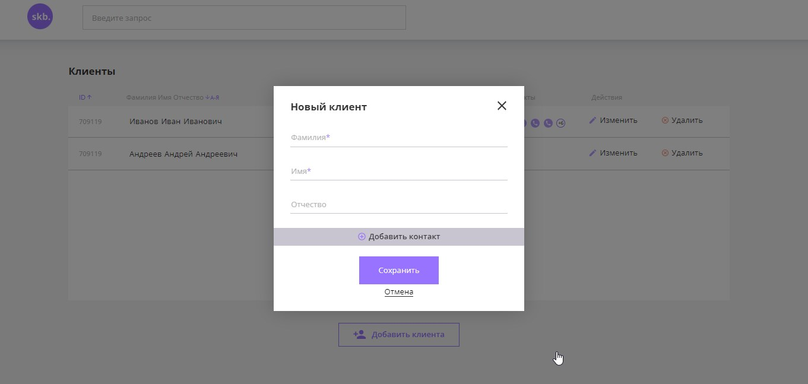
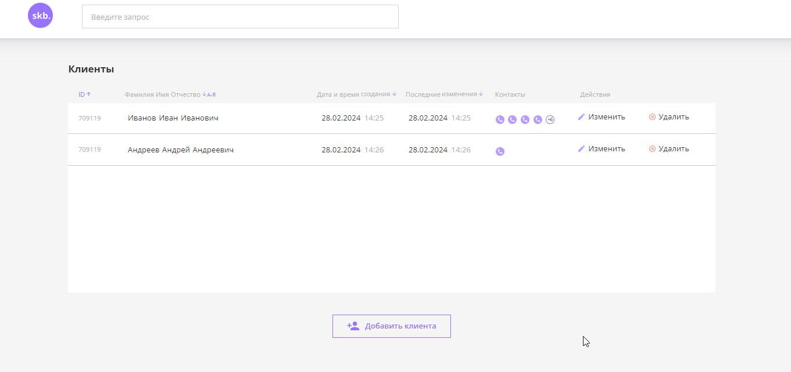
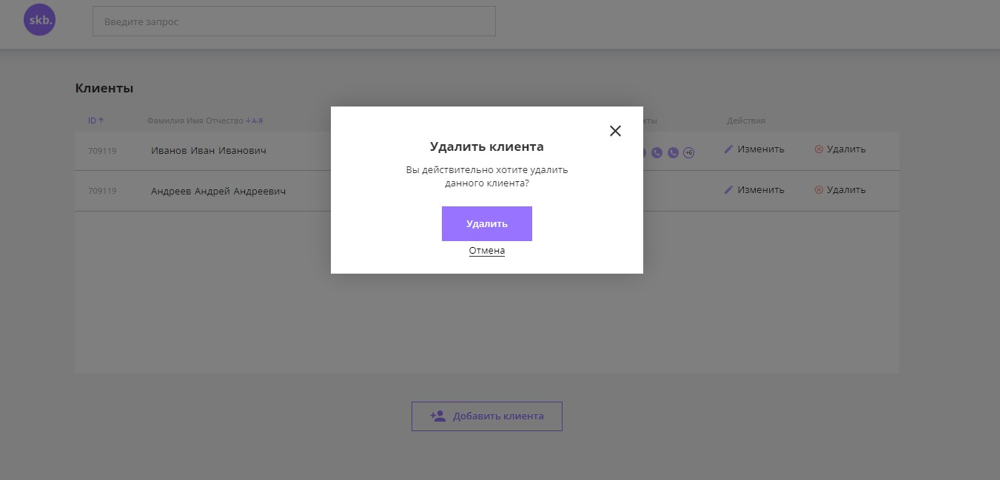
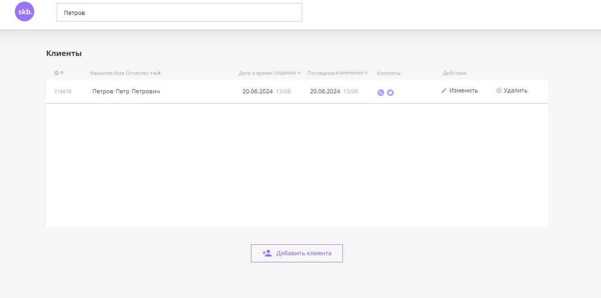
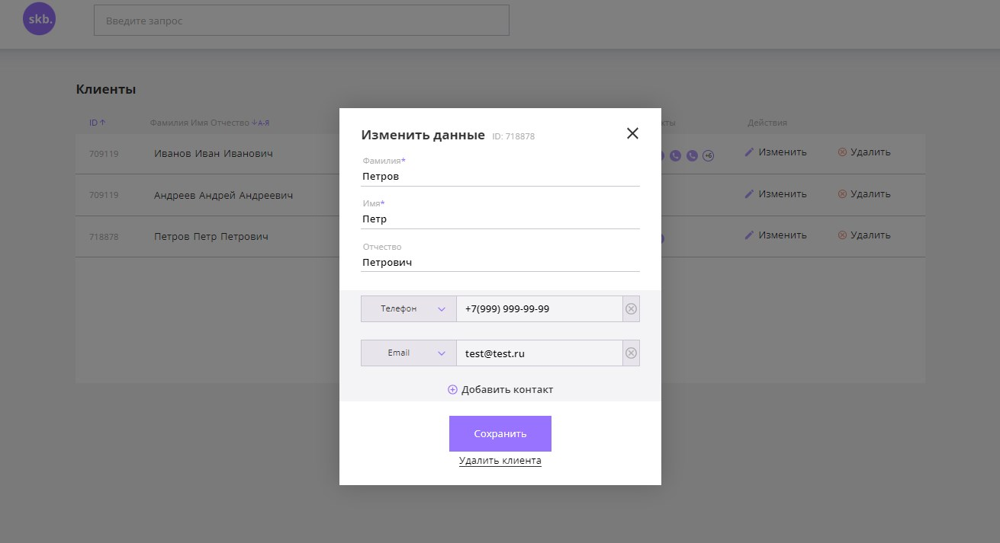
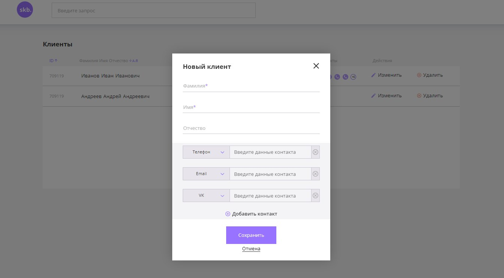

# CRM-система управления контактными данными клиентов

## Содержание
  - [Технологии](#технологии)
  - [Начало работы](#разработка)
  - [Визуал](#скриншоты)

## Технологии
  - HTML5
  - JSNative
  - CSS3

### Требования
  Для установки и запуска проекта, необходим [NodeJS](https://nodejs.org/) v8+.

## Разработка
  #### Для запуска клиента подойдёт любой локальный сервер (например Live server VSCode)
  #### Запуск бекенда см. README.md в ./crm-backend.

## Скриншоты
  
  
  
  
  
  

## Команда проекта
  - [Артём Кряквин](https://t.me/art_kryy) — Frontend-developer
